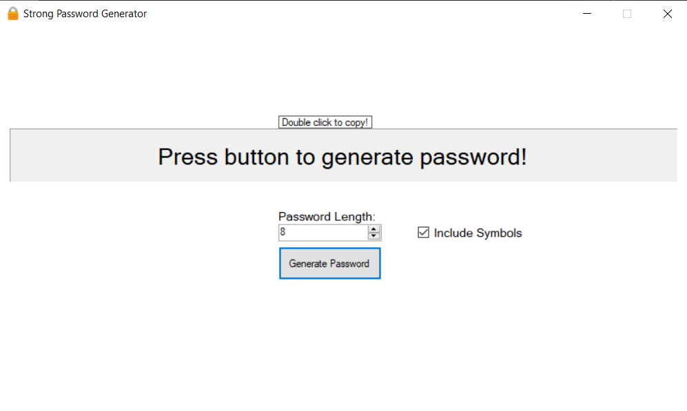

# Strong Password Generator

# Description
Standalone tool that randomly generates a strong password. 
Length can be set between 8 to 30 characters long. Choose whether to include symbols with the check box on the right. Double click to copy the newly generated password!

# Installation
- Download the latest .zip from the "[Releases](https://github.com/MccDev260/StrongPasswordGenerator/releases)" section of the GitHub repo.
- Extract the contents of the .zip folder to your desired directory.
- Open the .exe file to run the program!

## Disclaimer
This program is completely standalone and stores no information entered by or generated for the end user.

# Support
To report bugs, open a new issue with the 'bug' tag.

# Developers
If you wish extend or improve this program feel free to fork the repo or submit a pull request!